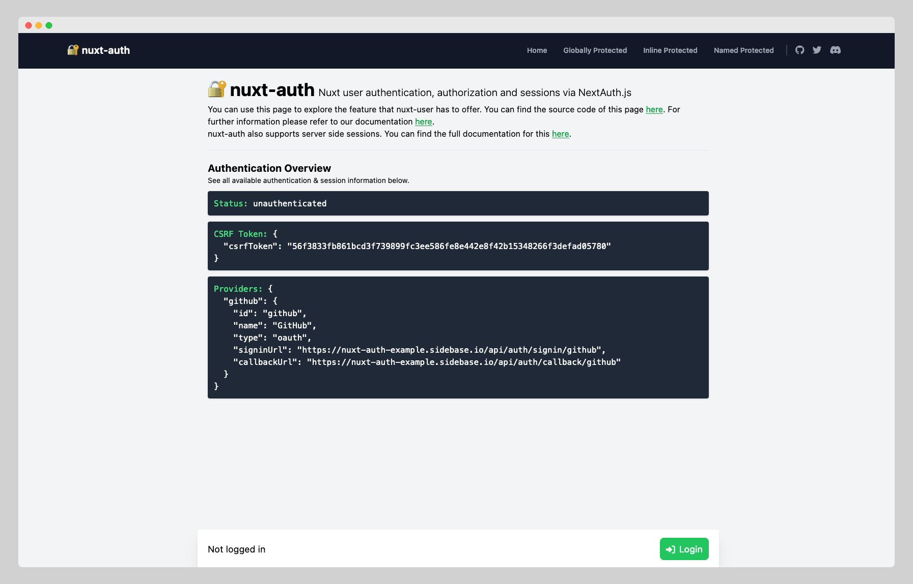

# Nuxt Auth Example

> This is an example project using [nuxt-auth](https://github.com/sidebase/nuxt-auth), the Nuxt module providing  authentication and sessions via [NextAuth.js](https://github.com/nextauthjs/next-auth). `nuxt-auth` wraps [NextAuth.js](https://github.com/nextauthjs/next-auth) to offer the reliability & convenience of a 12k star library to the nuxt 3 ecosystem with a native developer experience (DX).

The deployed version can be found [here](https://nuxt-auth-example.sidebase.io).



## Setup

To run this locally:
```bash
# install dependencies
npm install

# run dev server
npm run dev

# build production
npm run build

# start production build
npm run start
```

NOTE: For full functionality you'll need to add your own github oauth app client id and client secret in the [`NuxtAuthHandler`](./server/api/auth/%5B...%5D.ts). See [the next section](#environment-variables) for more on this and other configuration.

## Environment variables

The test deployment is done via docker-compose with `nginx-certbot` image which automatically issues certificate for the domain. Please don't forget to create `.env` file in the project root, which will contain:

- `GITHUB_CLIENT_*`
  - `GITHUB_CLIENT_ID` - A [GitHub OAuth](https://docs.github.com/en/developers/apps/building-oauth-apps/creating-an-oauth-app) Client Id
  - `GITHUB_CLIENT_SECRET` - A [GitHub OAuth](https://docs.github.com/en/developers/apps/building-oauth-apps/creating-an-oauth-app) secret
- `NUXT_SECRET` - A random string used to generate authentication tokens
- `ORIGIN` - The URL of your authentication api (should be https://example.com, this no trailing slash)
- `CERTBOT_*` - NuxtAuth requires a SSL certificate to run in production. We use Certbot to automatically generate these
  - `CERTBOT_DOMAIN` - The domain for which the Certbot should register a certificate
  - `CERTBOT_EMAIL` - The email under which the domain certificate will be registered
